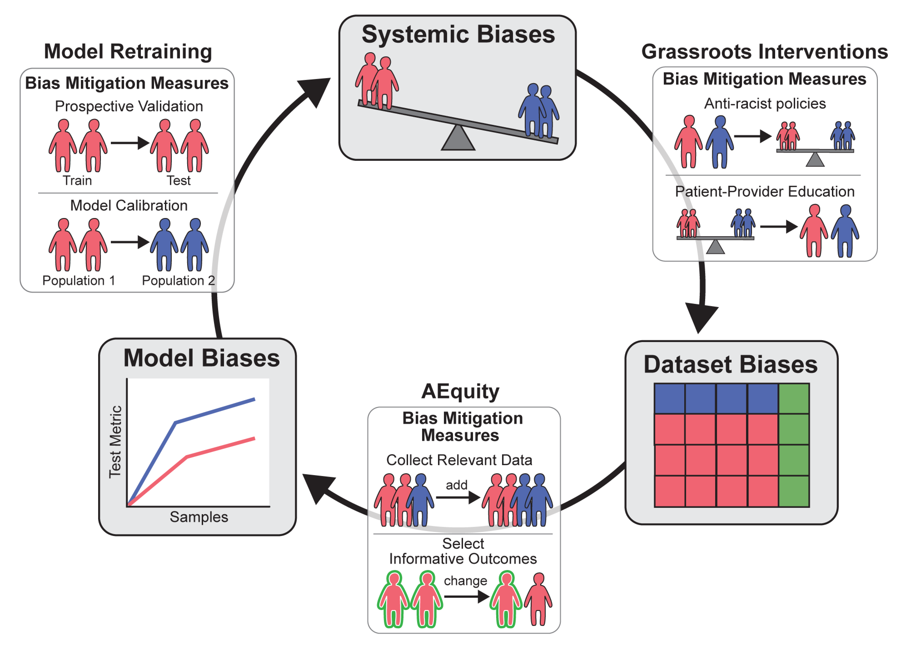
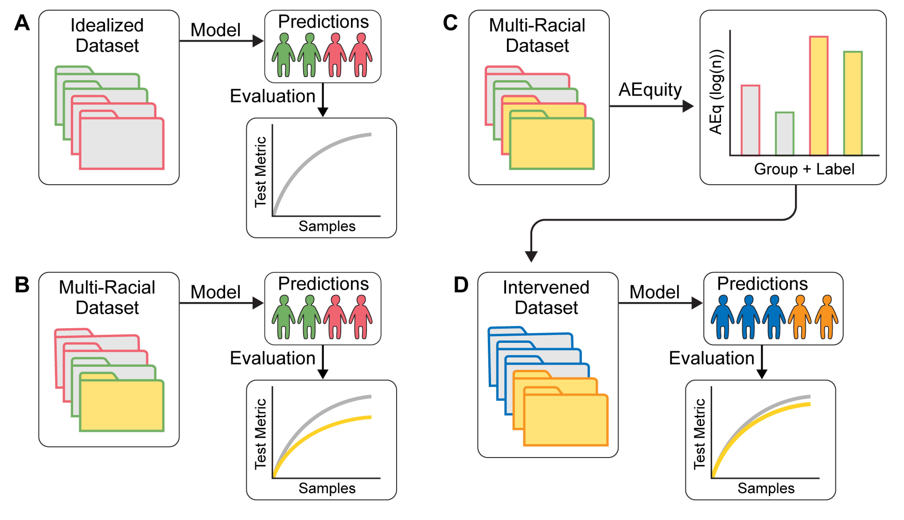
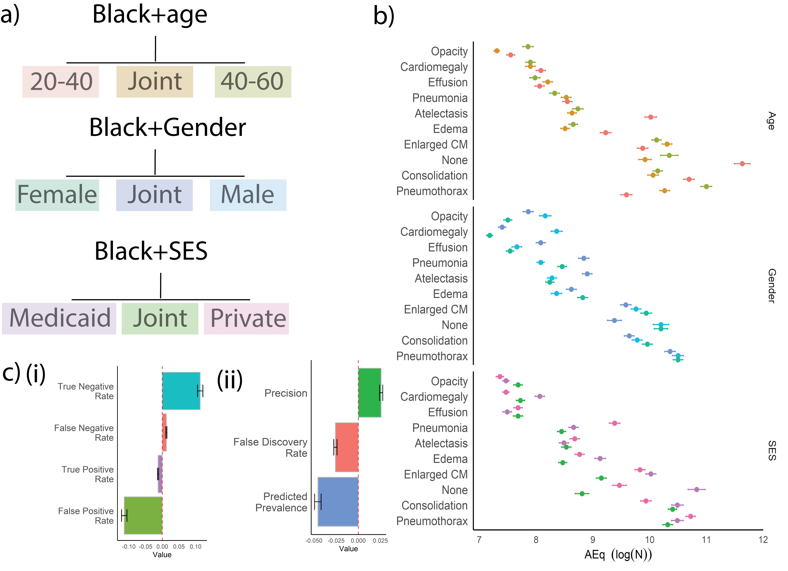
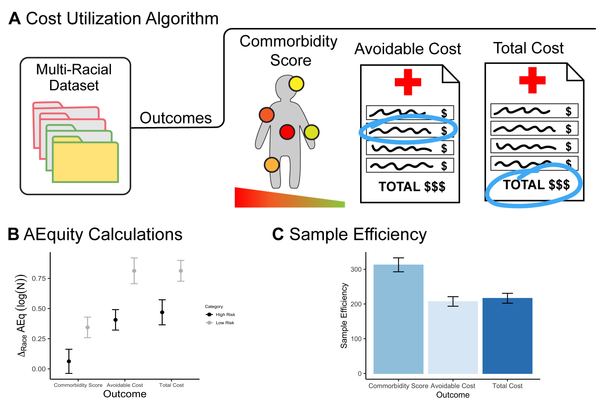

# AEquity
Deep Learning Based Metric to Mitigate Dataset Bias. This repository will be used for the NIH NCATs challenge. 

## Table of contents
- [Summary](#summary)
- [Introduction](#introduction)
- [Principles](#the-principles-of-aequity)
    - [Disentangling Biases](#aequity-to-disentangle-types-of-biases)
- [Applications](#applying-aequity-to-real-world-data)
    - [Predictive Bias](#predictive-bias-aequity-on-chest-x-ray-data)
    - [Social Bias](#social-bias-applying-aequity-to-cost-utilization-data)
- [Discussion](#discussion)
- [Using this Repository](#using-this-repository)
- [References](#references)


## Summary

Diagnostic and prognostic algorithms can recapitulate and perpetuate systemic biases against underserved populations. Post-hoc technical solutions do not work well because they are unable to overcome biased data used to train algorithms.. A more data-centric approach may help address bias earlier in the process of development of algorithms. We present AEquity (AEq), a sample-efficient deep-learning based metric, that measures the learnability of subsets of data representing underserved populations. We then show how the systematic analysis of AEq values across subpopulations allows the identification of different manifestations of bias in two healthcare datasets with demonstrated bias. In the first case, we analyze a computer vision model trained on chest radiographs to investigate its underperformance on chest X-rays from Black individuals for various diagnoses and develop targeted interventions at the dataset level which mitigate bias. We also apply AEq to a cost-predictive model to show how the choice of the label leads to bias against black patients, which can be remedied by predicting comorbidities instead of costs. Thus, AEquity is a novel and broadly applicable metric which can be applied to diagnose and remediate bias in healthcare datasets.


## Introduction 

Algorithmic bias is the inability of an algorithm to generalize to a given group, causing selective underperformance. Previous work has highlighted the problem of algorithmic bias in healthcare - algorithms developed using standard techniques on diverse datasets can still be significantly biased against individuals based on race/ethnicity or insurance status. For example, the application of standard computer vision models to chest radiographs resulted in selective underdiagnosis in under-served populations, and an algorithm used to predict health needs was found to exhibit significant racial bias against Black patients. This occurs because algorithms developed using data from a system with longstanding bias and inequities tend to recapitulate that bias. The use of biased algorithms, when used in clinical decision making, perpetuates systemic inequities.

Post-hoc technical solutions can help mitigate bias to a certain extent. However, these typically involve some form of recalibration which, except in narrow circumstances, implies a tradeoff between true-positive and false-positive rates in underserved populations. Thus, the need to address bias earlier in the algorithm development pipeline is being increasingly recognized. Post-hoc technical solutions can help mitigate bias to a certain extent. However, these typically involve some form of recalibration which, except in narrow circumstances, implies a tradeoff between true-positive and false-positive rates in underserved populations. Thus, the need to address bias earlier in the algorithm development pipeline is being increasingly recognized. 

Thus, we present AEquity. AEquity is a deep learning-based metric based upon this initial finding that is actionable at the level of the dataset and can be used for the characterization and mitigation of bias in healthcare datasets.



## The Principles of AEquity

We have previously shown that unsupervised learning with an autoencoder can estimate the minimum sample size needed to train a deep neural network on a given dataset. In this manuscript, we describe a deep learning-based metric based upon this initial finding that is actionable at the level of the dataset and can be used for the characterization and mitigation of bias in healthcare datasets. We call this metric AEq because it utilizes an autoencoder (AE) to provide actionable, data-driven feedback towards equitable performance (Figure 3). We first use a synthetic dataset to demonstrate that AEq can be used to distinguish and mitigate different manifestations of bias at the level of data. We then apply it to medical imaging and healthcare utilization datasets that are known to lead to biased algorithms.

We define AEq as the minimum sample size estimate stratified by a group characteristic, such as race or socioeconomic status. A higher AEq value for a group suggests that generalization is more difficult and more samples are needed for learning (Figure 2). AEq is reported as $log_2(sample size estimate)$ for interpretability. 

Under most constraints, AEq values exhibit dataset-specific properties, and can be used subsequently to guide data-driven, actionable feedback. In this manuscript, we demonstrate how AEq changes with different types of biases with a synthetic dataset. We then demonstrate its applicability to mitigate bias in a deep learning model trained on chest radiographs, and a model used to predict healthcare needs. We use the term groups to refer to various subpopulations, including race, gender, or insurance status. We use the term class to refer to the labels in classification problems that correspond to diagnoses. 



### AEquity to disentangle types of biases. 

We separate dataset biases into three distinct categories: sampling bias; complexity bias; and label bias. In sampling bias, a group is under-represented in the dataset and suffers from lower generalization performance in the resulting model. In complexity bias, a group exhibits a class label with greater complexity than another group. Subsequently, generalization performance on that group is worse than other groups for the same class. Third, label bias occurs when labels are placed incorrectly at different rates for different groups and can lead to increased misclassification errors for the affected group. 

As an example of sampling bias, we generate two synthetic datasets in which class labels are distributed differently. In group 1, the class labels at higher values are drawn at higher frequencies and lower AEq values. In group 2, the class labels at lower values are drawn at higher frequencies and have lower AEq values. Thus, higher frequency of sampling result in easier generalization, and therefore lower AEq values. If sampling bias is the only type of dataset bias, combining groups will drive the AEq value closer to the over-sampled data rather than the under-sampled data. Sampling bias is primarily driven by data availability – in dermatology datasets, for example, lighter-skinned populations are generally more represented and therefore have better generalizability than darker-skinned populations.

Complexity bias is characterized by different groups representing different distributions across a given label. We generate two synthetic datasets with differing complexity across classes and observe that the AEq of one group is significantly larger than the other group across specific classes. If complexity bias is the only type of dataset bias, combining the groups will result either in an increase in the value of AEq or AEq staying closer to the one which higher prior to the combination. This is because generalization requires information from two distinct distributions, which is generally harder to learn than a single distribution, especially if they are labeled the same. An example of complexity bias in a real dataset would be the presence of a greater number of comorbidities in patients from an underserved group making it more challenging to accurately predict outcomes in patients from that group, compared to other groups. 

We simulate label bias by generating synthetic data with the same underlying distribution but with varying percentages of correctly assigned labels. We can quantify label bias by the percentage labels that are considered correct or valid for a given group, and the subsequent discrepancies between those labels. We run experiments and show that percentage mislabeled should not change the group-specific AEq values because AEqs for a given group are label-agnostic. In contrast to complexity bias, labels can be re-assigned to improve dataset generalizability, whereas the complexity of a given label belonging to a specific subgroup is invariant to label structure. Label bias, with respect to AEq, is a diagnosis of exclusion. An example of label bias in a real dataset would be incorrect assignment of risk scores in an under-served population. The resulting bias is not dependent on the characteristics of the dataset, but rather the labels.


## Applying AEquity to real-world data. 

### *Predictive Bias*: AEquity on Chest X-ray data. 

We showed that AEq replicated the racial biases demonstrated by Seyyed-Kalantari et al in the MIMIC-CXR dataset and provide examples of data-centric interventions to mitigate them. We saw generally that a higher frequency of occurrence for a diagnosis corresponded to a lower AEq value across Black and white patients (Figures 4c, 4c). The model was able to learn a diagnosis of lung opacity (AEq ≈ 7.5) using far fewer samples than diagnoses, such as consolidation (AEq ≈ 9.8), enlarged cardio-mediastinum (AEq ≈ 9.9) or pneumothorax (AEq ≈ 9.95). We posit that this latter group of diagnoses may have the highest potential for bias because of difficulty in generalization. Second, we noticed that six out of the nine diagnoses, accounting for 71% of the positive samples, demonstrate higher AEq values in Black patients than in white patients. Higher AEq values indicate that, in general, chest X-rays from Black patients are more difficult to generalize to than their white counterparts.

Next, we examined pneumothorax, which occurs less frequently in Black individuals and for whom AEq is substantially higher than that for white individuals. The joint AEq is less than the AEq for each race, consistent with a sampling bias. The data-centric simulation with a diversified dataset was associated with an improvement in classifier performance for Black individuals (Figure 4d, middle pane). Finally, we looked at edema, where the joint AEq was higher than the AEq for either race, consistent with complexity bias. In this simulation, prioritizing data collection to include more chest radiographs from Black individuals was associated with a model that generalized better to Black patients (Figure 4d, right pane).


We replicated these findings in two additional datasets (NIH-CXR and CheXPert) and also with respect to gender, age and insurance status. Additionally, we demonstrated that our method can be applied to intersectional analyses wherein gender, age and insurance status are considered in addition to race. Mitigation of bias by our method was robust using a variety of traditional fairness measures, such as false positive rate, precision and false discovery rate.



### *Social Bias*: Applying AEquity to cost utilization data. 

We conducted an analysis utilizing AEq to replicate the results and conclusions of the dataset provided by the authors of Obermeyer et al. We showed that racial bias in cost-predictive algorithms can propagate systemic forms of inequity in health care resource allocation. Using cost as the risk-derived metric, Black patients at a given risk score were considerably sicker than their white counterparts.

We calculated the difference in AEq values between each race for each metric. The model demonstrated that when using active chronic conditions as the outcome metric, the difference in AEq between Black and white patients was not statistically significantly different from zero in the high-risk group (P = 0.22). In contrast, when using cost-based metrics such as avoidable costs and total costs, the difference in AEq between Black and white patients was significantly greater than 0 $P_{total costs} = 6.49E-10$; $P_{avoidable costs} = 1.67E-10)$, consistent with generalizability differences across different races, which fits the definition of algorithmic bias.

We found additionally that the differences in AEq across races of the low-risk groups were all significantly greater than 0 for each metric. We also observed that the differences in AEq were smaller when using active chronic conditions than avoidable costs or total costs, $(ANOVA, P = 1.59E-08)$.  



### Discussion

In summary, traditional approaches to the issue of algorithmic bias rely on post-hoc approaches which fail to address manifestations of bias at the level of datasets used to train algorithms. We present AEq, a novel, deep-learning based metric that may be valuable for disentangling and quantifying various manifestations of bias at the dataset level. We show how it can be used to suggest specific, effective mitigation measures. Finally, we demonstrate its robustness by applying it to different datasets, intersectional analyses and measuring its effectiveness with respect to a range of traditional fairness metrics.
 

## Using this repository

1. Install requirements.

These requirements are publicly sourced such as 

sklearn
torch
scipy
torchvision
pandas

```{bash}
pip install requirements.txt
```
And are also privately sourced: mainly cnnMCSE. 

2. Setup config file in a config.yaml file. 
```{yaml}
data_path: ./data/custom_data.tsv # Contains path to data. Contains independent variables, demographics, and outcome variables. 
demographics_col: demographics # Name of demographics variable in data_path.
outcome_cols: outcome_1  # Name of outcome variable in data_path
exclude_cols: None # name of columns to exclude if there are extraneous columns. 
out_data: ./output/data.tsv # Output directory for AEq analyses. 
bootstraps: 10 # Number of bootstraps. 30-50 is typically recommended for resolution at 5000 samples. 
start_seed: 42 # Seed experiments. 
input_dim: 149 # Number of independent columns in data_path
max_sample_size: 5000 # Max sample size to calculate from. Usually only require 128-512 samples. 
root_dir: ./weights # Root directory to output weights, and other output files. 
```

3. Run the measure and mitigate experiments.
```{bash}
python measure_disparity.py --config config.yaml
python mitigate_disparity.py --config config.yaml
```

Additional configurations are built for more complex models (AlexNet, ResNet, EfficientNet), but require a built in dataloader. 
Built in dataloders can be built by modifying the cnnMCSE repository. 
See the cnnMCSE repository for more details.


## References

Please cite
```
@misc{Deep Learning Based Metric to Mitigate Dataset Bias,
  author = {Anonymous},
  title = {A},
  year = {2023},
  publisher = {GitHub},
  journal = {GitHub repository},
  howpublished = {\url{https://github.com/AEquitas}}
}
```

